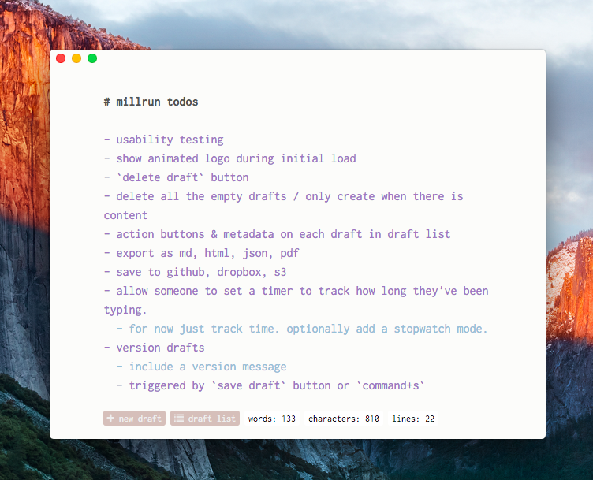

# millrun

> A writing app for your lumps.


## About

millrun is an [electron](http://electron.atom.io) app for writing drafts of articles, books, etc.

The features are limited! The design is simple! The goal is ambitious!

**Learn more at the website: [millrun.civicmakerlab.com](http://millrun.civicmakerlab.com)**



## The goal
Provide the best experience for drafting prose.

## Current features

- Create new drafts.
- Edit those drafts.
- Export drafts as html/json/markdown.
- Delete the drafts.
- Easily track word count of each draft.

## Installation

You can install via the website: [millrun.civicmakerlab.com](http://millrun.civicmakerlab.com)

Or you can install the app as a command-line tool using npm:

```sh
npm install -g millrun
```

## Usage

If you've installed millrun as a command-line tool, start the app by running the `millrun` command:

```sh
millrun
```

Otherwise, if you downloaded the OSX build of the app, just double click the app and off you go.

## License
MIT
